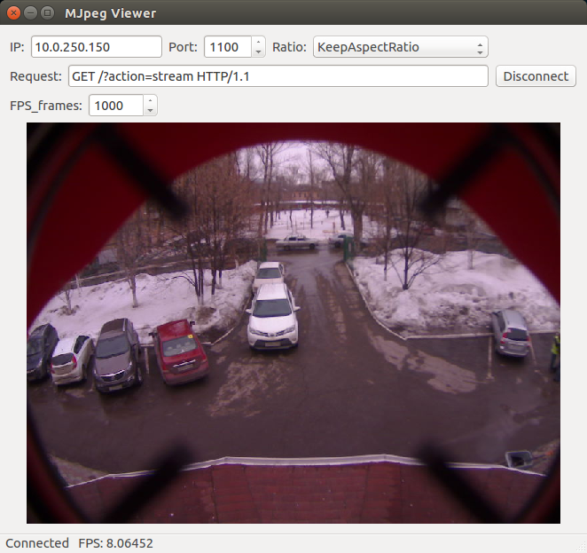

# QMJpeg_Viewer on Qt


## Description
QMJpeg_Viewer is an application that demonstrates how work Qt class **[QMJpegViewer](./qmjpeg_viewer.h)**





**The class has the following public methods:**
```C++
void  connect_to_host(const QString &host_name, quint16 host_port);
void  disconnect_from_host();

int   send_request(const QByteArray &request);

void  set_qlabel(QLabel *qlabel);
float get_fps() { return _fps; }

quint32 set_max_mjpeg_header_size(quint32 size);
quint32 get_max_mjpeg_header_size() { return _max_mjpeg_header_size; }

quint32 set_max_jpeg_size(quint32 size);
quint32 get_max_jpeg_size() { return _max_jpeg_size; }

void  set_socket_size(qint32 size) { _tcp_socket.setReadBufferSize(size);}

QAbstractSocket::SocketError socket_error() {return _tcp_socket.error();}
QAbstractSocket::SocketState state() {return _tcp_socket.state();}
```


**The class has the following public signals:**
```C++
signals:

void connected();
void disconnected();
void updated_fps(float fps);
void error(QMJpegViewer::MJpegViewerError);
```


**The class has the following public enums:**
```C++
enum MJpegViewerError
{
    InnerSocketError,   //for detail see socket_error()
    BrokenHeader,
    MaxJpegSize,
    CantFindJpegOffset,
    CantLoadJpeg,

    UnknownError = -1
};
```

More details see: **[qmjpeg_viewer.h](./qmjpeg_viewer.h)**


## Build

```console
qmake
make
```


<br/>
## License

[BSD](./LICENSE).


## Copyright
Copyright (C) 2016 Koynov Stas - skojnov@yandex.ru
